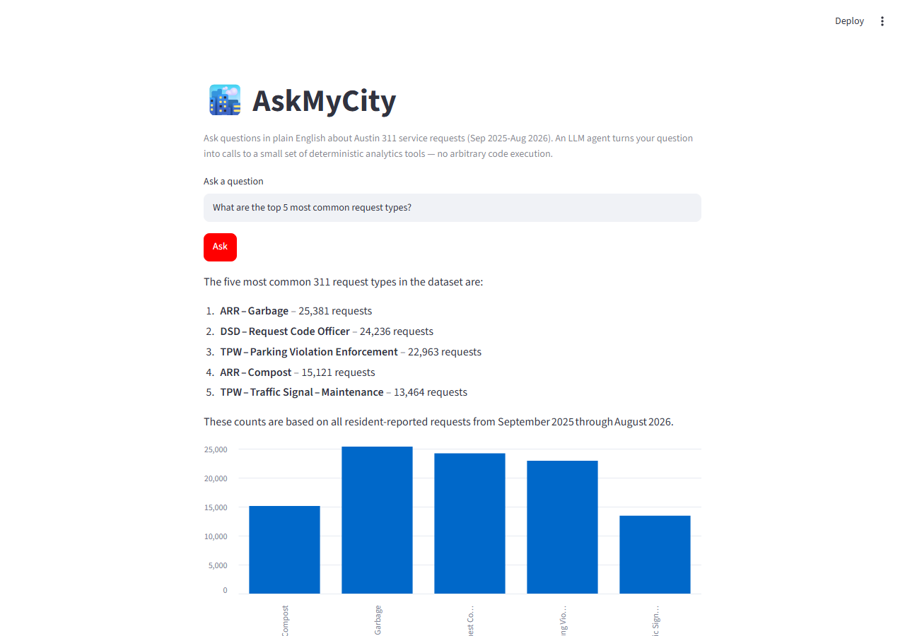

# AskMyCity 🏙️

Ask plain-English questions about a city's open 311-style service request
data ("How many potholes were reported in the North district last winter?",
"What are the top 5 complaint categories this year?") and get back a
grounded natural-language answer plus a chart — generated by a tool-use LLM
agent (Groq/GPT-OSS-120B) that computes real numbers instead of guessing them.

**Live demo:** [askmycity-k5v44kbmmns8kwsfp9di3q.streamlit.app](https://askmycity-k5v44kbmmns8kwsfp9di3q.streamlit.app/)
_(Streamlit Community Cloud requires a quick one-click sign-in — Google/GitHub/email — before showing any app; that's a platform-wide policy, not specific to this one.)_


## Problem statement

City open-data portals publish enormous 311/service-request datasets, but
they're only useful to someone who already knows how to write a pandas
groupby. AskMyCity puts a conversational layer on top of one such dataset so
a plain-English question gets a sourced, numeric answer — with the exact
computation that produced it shown alongside, not hidden inside the model.

## Architecture

The model **never** executes arbitrary code and never sees the raw
dataframe. It can only pick from a small, fixed set of deterministic tools
and typed arguments; the actual computation happens in plain, independently
unit-tested Python.

```
                        ┌─────────────────────┐
   question ───────────▶│  Streamlit UI        │
                        │  (app/streamlit_app) │
                        └──────────┬───────────┘
                                   │
                                   ▼
                        ┌─────────────────────┐        tool call (JSON args)
                        │  Agent loop          │───────────────────┐
                        │  (askmycity.agent)   │◀──────────────────┘
                        │  Groq tool-use API   │   tool result (JSON)
                        └──────────┬───────────┘
                                   │ picks tool + args only
                                   ▼
                        ┌─────────────────────┐
                        │  Deterministic tools │
                        │  (askmycity.tools)   │
                        │  filter_and_aggregate│
                        │  top_n               │
                        └──────────┬───────────┘
                                   │ pandas ops
                                   ▼
                        ┌─────────────────────┐
                        │  Cached dataset      │
                        │  (data/*.csv)        │
                        └─────────────────────┘
```

- **`src/askmycity/schema.py`** — describes the dataset's columns once, and
  builds provider-agnostic tool JSON schemas from that description.
- **`src/askmycity/tools.py`** — `filter_and_aggregate` and `top_n`: plain
  pandas functions, fully unit-testable without the LLM.
- **`src/askmycity/agent.py`** — the tool-use loop: sends the question +
  tool definitions to Groq (GPT-OSS-120B), executes whichever tool it
  picks, feeds the result (or a validation error, so the model can
  self-correct) back, and returns a final answer plus the full tool-call
  trace.
- **`app/streamlit_app.py`** — the UI: question box, chart, NL answer, and
  an expandable **"How I got this"** panel showing the exact tool call(s)
  the model made — the transparency/agentic story made visible.

## Dataset

[Austin 311 Public Data](https://data.austintexas.gov/Utilities-and-City-Services/Austin-311-Public-Data/xwdj-i9he)
(Socrata, public domain, attributed to the City of Austin) — a fixed 12-month
window (Sep 2025–Aug 2026), 280k+ service requests, cached in-repo as
`data/austin_311_*.csv.gz` (~7MB) so the app doesn't depend on a live API.
See `data/DATA_DICTIONARY.md` for columns/known quirks and
`data/eval_questions.md` for the 20-question eval set used to test the agent
(results in `data/eval_results.md`).

## Running locally

```bash
python -m venv .venv
source .venv/bin/activate  # or .venv\Scripts\activate on Windows
pip install -r requirements.txt
pip install -e ".[dev]"

cp .env.example .env  # then fill in GROQ_API_KEY (free signup at console.groq.com)
export $(cat .env | xargs)  # or use direnv / your shell's preferred method

streamlit run app/streamlit_app.py
```

### Configuration

The app reads `GROQ_API_KEY` from the environment — never hardcode it.

- **Local dev:** set it in your shell or a local `.env` (see `.env.example`;
  `.env` is gitignored).
- **Streamlit Community Cloud:** set it under the app's **Settings → Secrets**
  as `GROQ_API_KEY = "gsk_..."`.

## Tests

```bash
pytest -v      # unit tests for the tools + agent loop, and an app smoke test
ruff check .   # lint
```

Tool and agent-loop tests run against a small synthetic fixture dataset
(`tests/conftest.py`) so they don't depend on the real cached dataset.
Once the real dataset and `data/eval_questions.md` land, the eval question
set is run end-to-end against the live agent as a correctness check.

## Deployment

Deployed on [Streamlit Community Cloud](https://streamlit.io/cloud):
point it at `app/streamlit_app.py`, set the `GROQ_API_KEY` secret, and
deploy.

> **Notes:**
> - Groq's free tier caps at 200K tokens/day per model. Fine for normal demo
>   use; heavy iteration (e.g. re-running the full eval set repeatedly) can
>   hit it.
> - Streamlit Community Cloud requires viewers to sign in (Google/GitHub/
>   email, one click) before seeing any app, public or not — a platform
>   policy, not something this app's settings control.

## How this was built

Built by three Claude Code sessions working as a small team: a **team lead**
(scoping, coordination, code review, merges), a **researcher** (dataset
selection/licensing, data dictionary, eval question set), and a **developer**
(architecture, implementation, testing). Each worked in its own [git
worktree](https://git-scm.com/docs/git-worktree) on its own feature branch,
opening PRs reviewed and merged by the team lead — see `CONTRIBUTING.md` /
`AGENTS.md` for the workflow rules the team followed.

Running the 20-question eval set against the live agent — not just unit
tests — surfaced 6 real bugs (a silently-dropped date filter, an off-by-a-day
undercount, model-specific output leakage, missing retry/error handling)
that all passed a clean test suite beforehand. Full detail in
`data/eval_results.md`.

## License

MIT — see [LICENSE](LICENSE).
